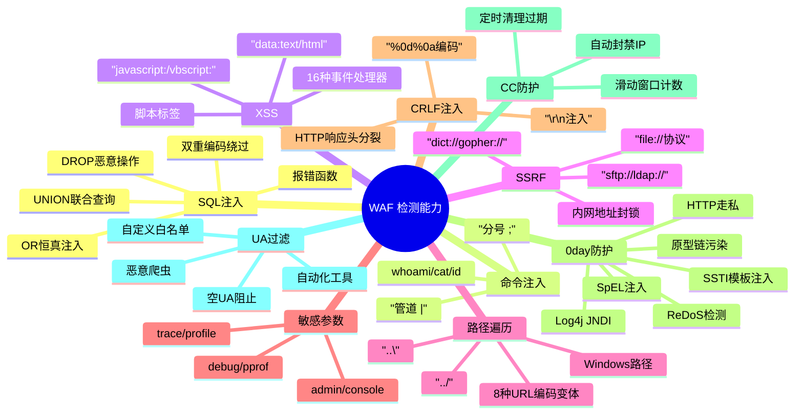

# GoNeo WAF

GoNeo WAF 是一个基于 Go 语言、以 Gin 中间件形式提供的 Web 应用防火墙。它通过对 HTTP 请求进行多维度检测，实时拦截各类 Web 攻击，即插即用、性能微秒级。**OWASP Top 10 测试 32/32 全部通过，成功率 100%。**

所有检测规则以 JSON 文件管理，每条规则带有独立威胁评分，命中时记录详细日志（规则ID、名称、评分、攻击类型、来源IP）。

## 快速集成

```go
import (
    "time"
    "github.com/waf-go/waf/core"
    "github.com/gin-gonic/gin"
    "go.uber.org/zap"
)

func main() {
    zap.ReplaceGlobals(zap.Must(zap.NewProduction()))

    cfg := core.NewConfigBuilder().
        Enabled(true).
        WithCCProtection(true, 60, 10*time.Minute).
        WithSQLInjection(true).
        WithXSSProtection(true).
        WithSSRFProtection(true).
        WithCRLFProtection(true).
        WithZeroDayProtection(true).
        WithPathTraversalProtection(true).
        WithSensitiveParamProtection(true).
        Build()

    r := gin.Default()
    r.Use(core.New(cfg).Middleware())
    r.GET("/ping", func(c *gin.Context) { c.JSON(200, gin.H{"message": "pong"}) })
    r.Run(":8080")
}
```

也支持复制 `core/` + `ip2region/` 目录到项目中直接使用，无需 `go get`。

### 更多用法

| 场景 | 配置 | 说明 |
|------|------|------|
| **放行监控路径** | `WithNodeReportPaths([]string{"/health", "/metrics"})` | 低强度检测，避免误拦 |
| **IP 白名单** | `WithAllowedNetworks([]string{"10.0.0.0/8", "192.168.0.0/16"})` | 内网 IP 跳过全部检测 |
| **获取统计数据** | `wafInstance.GetStats()` | 返回拦截数、被封禁 IP Top20 等 |

### 配置项速查

| 方法 | 默认值 | 说明 |
|------|--------|------|
| `Enabled` | `true` | 总开关 |
| `WithCCProtection` | `true, 60次/分, 封禁10min` | CC 防护阈值与封禁时长 |
| `WithAttackProtection` | `5次/10min, 封禁1h` | 攻击封禁策略 |
| `WithSQLInjection` | `true` | SQL 注入检测 |
| `WithUAFilter` | `true, 主流浏览器` | UA 白名单过滤 |
| `WithXSSProtection` | `true` | XSS 检测 |
| `WithSSRFProtection` | `true` | SSRF 检测 |
| `WithCRLFProtection` | `true` | CRLF 注入检测 |
| `WithZeroDayProtection` | `true` | 0day 攻击检测 |
| `WithPathTraversalProtection` | `true` | 路径遍历检测 |
| `WithSensitiveParamProtection` | `true` | 敏感参数防护 |
| `WithStrictMode` | `false` | 严格模式 |
| `WithMaxRequestSize` | `2MB` | 最大请求体 |
| `WithIP2RegionDBPath` | `./data/ip2region_v4.xdb` | IP 地理库路径 |
| `WithAllowedNetworks` | `空` | 可信 CIDR 网段 |
| `WithNodeReportPaths` | `空` | 低强度检测路径 |

## 检测能力全景



| 检测能力 | 覆盖范围 |
|---------|---------|
| **SQL注入** | UNION, OR恒真, DROP, 报错函数, 双重编码绕过 |
| **命令注入** | 管道, 分号, 系统命令(whoami/cat/id) |
| **XSS** | 脚本标签, 16种事件处理器, javascript/vbscript/data协议 |
| **SSRF** | 内网地址封锁, file/dict/gopher/sftp/ldap危险协议 |
| **路径遍历** | ../, ..\, 8种URL编码变体, Windows路径 |
| **敏感参数** | debug/pprof/trace/profile/admin等调试端点 |
| **CRLF注入** | %0d%0a编码, \r\n注入, HTTP响应头分裂 |
| **0day防护** | Log4j JNDI, SSTI模板, 原型链污染, HTTP走私, ReDoS, SpEL |
| **CC防护** | 滑动窗口计数, 自动封禁, 定时清理 |
| **UA过滤** | 恶意爬虫, 自动化工具, 空UA, 自定义白名单 |

## OWASP Top 10 测试结果

| 指标 | 结果 |
|------|:----:|
| 总测试数 | 32 |
| 通过 | 32 |
| 失败 | 0 |
| 攻击拦截 | 27 |
| 正常放行 | 5 |
| **误拦率** | **0%** |

覆盖 OWASP Top 10（2021）全部类别，含 A01-A10 共 20 项 + XSS/CRLF/编码绕过 6 项 + 正常请求验证 6 项，**32 项全部通过，成功率 100%**。

## 项目结构

```
GoNeo-WAF/
├── core/           # WAF 核心（检测引擎 + 中间件）
│   ├── waf.go      # 检测逻辑
│   └── config.go   # 配置构建器
├── rules/          # 规则系统（JSON 管理 + 威胁评分）
│   ├── rules.json  # 所有检测规则（含评分）
│   └── rule.go     # 规则加载引擎
├── data/           # IP 地理数据库
│   └── ip2region_v4.xdb
├── ip2region/      # IP 地理位置查询模块
│   └── ip2region.go
├── example/        # 使用示例
│   └── main.go
├── LICENSE         # Apache 2.0
└── README.md
```

## 依赖

| 依赖 | 用途 |
|------|------|
| github.com/gin-gonic/gin | HTTP 框架与中间件机制 |
| go.uber.org/zap | 结构化日志 |
| github.com/lionsoul2014/ip2region/binding/golang | IP 地理位置查询引擎 |

## 版权与许可

本项目采用 **Apache 2.0 协议** 开源。数据文件 `ip2region_v4.xdb` 来源于 [lionsoul2014/ip2region](https://github.com/lionsoul2014/ip2region)（Apache 2.0）。
